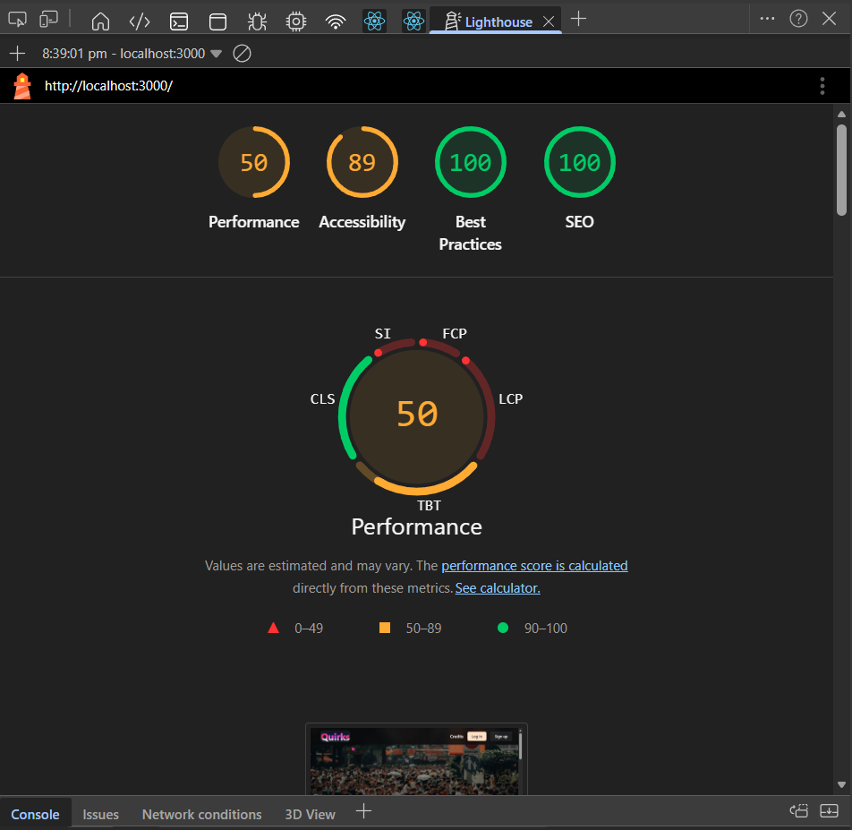
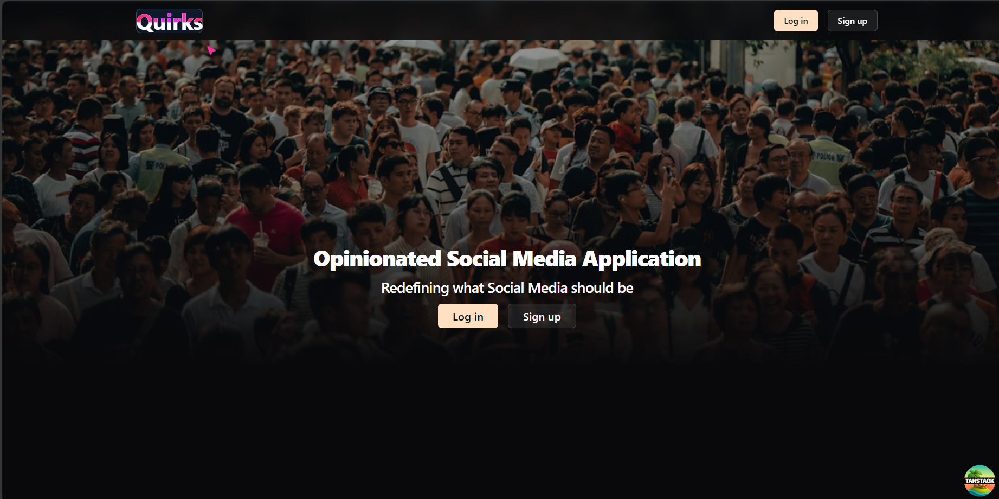
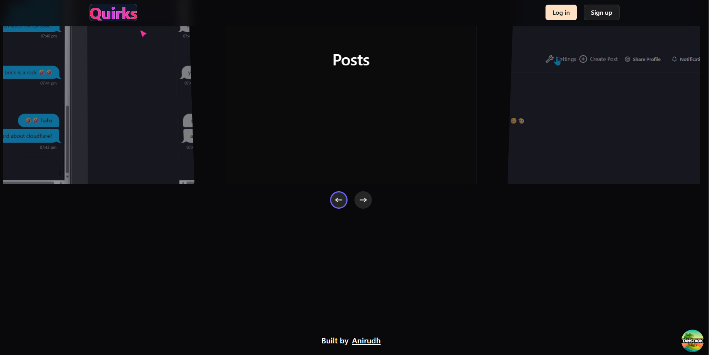
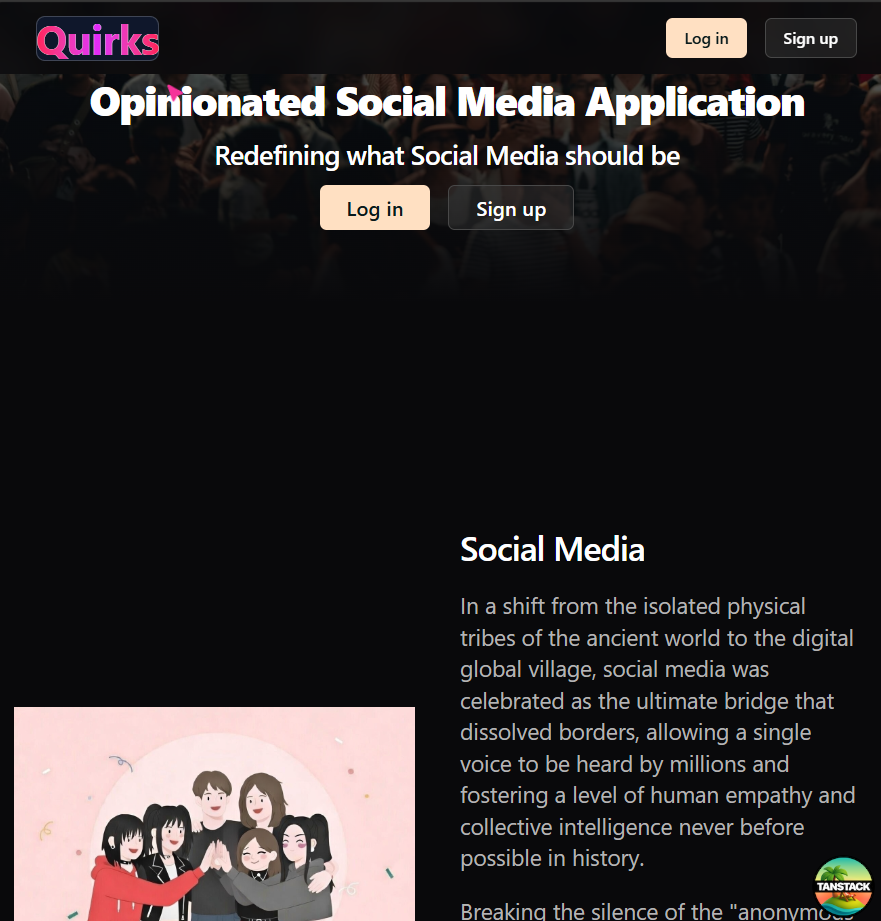

# Quirks

Social Applications are meant to network and meet people rather, it has become algorithm optimized content driven application. Quirks is built as an alternative to make people-driven social app with forced cooldown and encouraged (not forced) conversations.

## Video
[ani-cli-demo.webm](https://github.com/user-attachments/assets/fe23b51b-cb55-4f63-a5b1-3c477212405e)

## Gallery
- Lighthouse reports (5-3-2026)

- Landing page (header)

- Landing page (middle)

- Landing page (footer)

## Tech Stack

BEST Stack

- [Bun.js](https://github.com/oven-sh/bun): Bun is a fast, incrementally adoptable all-in-one JavaScript, TypeScript & JSX toolkit.
- [Elysia.js](https://github.com/elysiajs/elysia): Bun native Backend framework with End-to-End Type Safety, formidable speed, and exceptional DX across runtime.
- [Supabase](https://github.com/supabase/supabase): Supabase is an open-source Backend-as-a-Service (BaaS) platform built on top of PostgreSQL.
- [Tanstack Router](https://github.com/TanStack/router): Tanstack Router is type-safe, and framework-agnostic routing library.

Dependencies:

- [Shacn](https://github.com/shadcn-ui/ui): A customizable UI library, build on top of radix-ui (now supports base-ui) and tailwindcss.
- [Tanstack Query](https://github.com/TanStack/query): Framework agnostic powerful asynchronous state management, server-state utilities and data fetching.
- [Tanstack Form](https://github.com/TanStack/form): Headless, performant, and type-safe form state management
- [Tailwind CSS](https://github.com/tailwindlabs/tailwindcss): A utility-first CSS framework for rapid UI development.
- [React Virtuoso](https://github.com/petyosi/react-virtuoso): High performance virtual rendering to reduce web freeze due to large lists.
- [Framer motion](https://github.com/motiondivision/motion): A production-ready react animation library.
- [Nice logger](https://github.com/tanishqmanuja/nice-logger): A lightweight, nice and sweet logger for Elysia.js
- [uWebSockets](https://github.com/uNetworking/uWebSockets): High performance websocket library built-in for Bun.js and Elysia.js

## Architecture

This project fully relies Bun.js and Supabase.

## Frontend

- This used stable version of React (v19), Tanstack Router (v1), Tanstack React query (v5), Tanstack Form (v1), Tailwind Vite (v4), React Virtuoso (v4), Framer Motion (v12), Vite (v7) and Zod (v4).
- Frontend uses 2 custom hooks **time-provider** and **auth-provider** where _auth-provider_ and _query client_ are included as router context.
- Vite is the build tool that is used for bundling and compiling the frontend code.
- **Tanstack router** is a powerful React SPA router, with fully type-safe APIs, first-class search-params for managing state in the URL and seamless integration with the existing React ecosystem.
- **Tanstack query** is a powerful asynchronous state managemnt and server state utility package that uses custom caching and re-fetching logic
- **React Virtuoso** is a high performance virtual rendering to reduce web freeze due to large lists.

## Backend

- This uses stable version of Elysia.js (v1) and Bun.js (v1) 
- **Elysia.js** is a bun native typescript based backend Framework with End-to-End Type Safety, formidable speed, and exceptional DX across runtime.
- This complety relies on Supabase.js (for data layer) and Bun.js (for runtime, compatibility and websockets).
- This uses Elysia.js's built-in websocket (**uWebSockets**) support for seamless web sockets integration along with currently implemented REST methods.
- This uses nice-logger for logging
- Socket.io is natively built on-top of Node.js engine, hence it has compatibility issues, it can be used but is usually not recommended.
- Native Bun.js websockets are known for being meticulously optimized for speed and memory footprint, fully standards compliant with a perfect Autobahn|Testsuite score since 2016.
- It uses Elysia.js's built-in rate limiting and CORS support.
- Routes (Base Routes): `/friendship`, `/message`, `/post`, `/showdown`, `/user`

## Algorithms

- **Showdown Sync**: A custom synchronization algorithm that manages game state across multiple socket connections.
- It uses server-side RNG-based math expression generator that creates balanced problems with designated solution ranges to ensure a fair competitive environment.
- Formula: FL = aC * aI
- FL = Feed unlocked, 
- aC = Correct answer of 1st user, 
- aI = Correct answer of 2nd user

- **SPA Routing**: Handled by Tanstack router, SPA routing is a routing technique that is used to create a single page application. It makes user believe they are navigating to multiple pages, but in reality it is just rendering the components based on the URL.
- Formula: C = R(U)
- C = Component
- R = Render
- U = URL

- **Websockets**: Bun native uWebSockets is used for real-time communication between 2 ports.
- Formula: S(t) = {Mc​(t), Ms​(t)}
- S(t) = State at time t
- Mc​(t) = Message of client at time t
- Ms​(t) = Message of server at time t

- **Server state in Frontend**: Handled by Tanstack Query, it is the gold standard for data fetching using React and also has many features like caching, re-fetching, etc.
- Formula: C(k) = f(F(k), t)
- k = cache key
- C(k) = Cache of key
- F(k) = Fetch function
- t = refetch/stale logic 

- **Virtual rendering**: Handled by React Virtuoso, it is a high performance virtual rendering to reduce web freeze due to large lists.
- Formula: V = h/H​
- V = Visible Items
- h = item height
- H = Viewport height

- **Rate limiting**: Handled by Elysia.js, it is a rate limiting algorithm that is used to limit the number of requests that can be made to a server in a given time period.
- Formula: T(t)=min(C,T(t−1)+r⋅Δt)
- T(t) = Number of requests at time t
- C = Capacity of the bucket
- r = Rate of requests
- Δt = Time interval

--

## Technical Highlights & Complex Implementations

### 1. Real-time Multiplayer Synchronized Quiz (Showdown)
- **State Machine**: Orchestrates a multi-phase game flow (`idle` → `waiting` → `full` → `success`/`failure`) synchronized across distributed clients via WebSockets.
- **Bi-directional Sync**: Implements `sync-answer` events that broadcast keystroke-level updates to opponents, creating a "live presence" effect.
- **Server-Side Validation**: Ensures game integrity by validating math results on the Bun/Elysia backend before persisting state changes to Supabase.
- **Discovery Mechanism**: Combines REST polling (for invite detection) with WebSocket subscriptions (for active gameplay) to manage peer matching.

### 2. High-Performance Real-time Messaging
- **Room-Based Subscriptions**: Leverages Elysia’s `ws.subscribe` to isolate conversations into globally unique rooms, preventing message leakage between chats.
- **Optimistic UI & Persistence**: Achieves sub-50ms perceived latency using optimistic state updates in React, while asynchronously persisting messages to PostgreSQL via Supabase after broadcast.
- **Message Grouping Logic**: A sophisticated frontend grouping algorithm that reduces DOM weight and improves readability by batching consecutive messages from the same sender.

### 3. Advanced State & Routing Architecture
- **Type-Safe Routing**: Utilizes TanStack Router’s code-based routing for 100% type safety across recursive layouts and protected route groups (`_protected`).
- **Unified Provider Pattern**: Injects `AuthContext` and `QueryClient` as router context, ensuring that data-fetching and security policies are enforced at the routing layer before component mounting.
- **Efficient Vertical Scaling**: Implements `React Virtuoso` for social feeds and message lists, maintaining a constant memory footprint regardless of data volume.

### 4. Security & Performance Layers
- **Token-Based Auth**: Validates Supabase JWTs during both REST calls and WebSocket handshakes to ensure secure cross-origin communication.
- **Aggressive Rate Limiting**: Built-in Elysia middleware prevents API abuse on sensitive quiz and messaging endpoints.
- **Bundle Optimization**: Leverages Vite 7 and Tailwind 4 for minimal runtime overhead and rapid HMR (Hot Module Replacement).